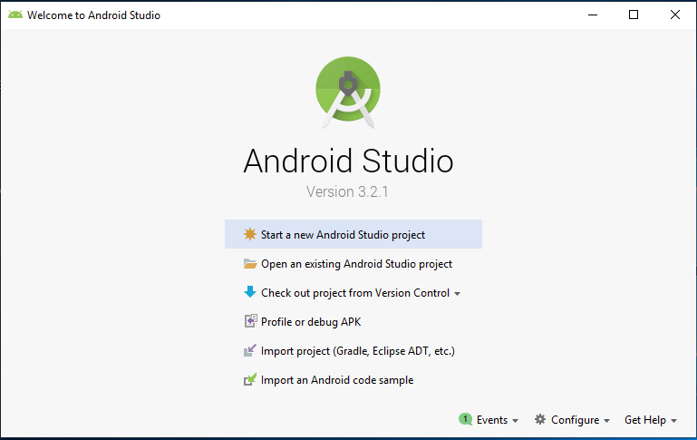
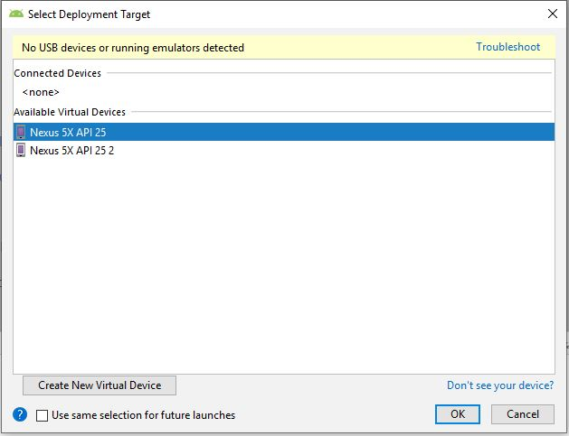

# HuqariqApp

Huqariq es una aplicación mobile open-source para la recolección de voces. Huqariq esta desarrollo enteramente en Android y permite la creación de speech-corpus para lenguas de escasos recursos como el Quechua por la cual fue desarrollo en principio. 

* [Funcionalidades](#funcionalidades)
* [Entorno de configuración](#entorno-de-configuración)
* [Aplicación en prueba](#aplicación-en-prueba)
* [Limitaciones](#limitaciones)
* [Contacto](#contacto)

# Funcionalidades

## Módulo de Registro

El módulo de registro permite al usuario registrarse en la aplicación; este registro es importante para conocer la variedad dialectica que habla el usuario y ademas para contabilizar algunas estadisticas por usuario y dialecto.

A continuación se muestra las interfaces del módulo de registro.

## Módulo de Grabación

El módulo de grabación permite a los usuarios grabar sus voces en su respectivo dialecto, ya que a la hora de registrarse Huqariq verifica la variedad dialectica la cual habla y en base a eso la aplcación le envia los audios en su dialecto.

A continuación se muestra las interfaces del módulo de grabación.

## Módulo de Recursos

El módulo de registro permite a los usuarios utilizar la aplicación sin necesidad de tener Internet. Esta característica es muy útil para zonas donde la conectividad es muy limitada.

Huqariq guarda las grabaciones realizadas por los usuarios en el celular hasta que pueda encontrar conexión con el servidor, una vez encontrada esa conexión, los audios son enviados al servidor, caso contrario se siguen almacenando en el celular.

El código responsable de está funcionalidad se encuentra en "MainActivity.kt"

# Entorno de configuración

Para poder utilizar Huqariq debe descargar or clonar el repositorio.

## Requisitos

> *Supported mobile platforms:* Android
> *Developed with:* Windows Phone SDK 8.1, Apache Cordova 4.0.0, jQuery Mobile 1.4.5, jQuery 2.2.0

# Aplicación en prueba

## Android Studio

1. Para poder probar la aplicación primero debes de abrir Android Studio y dirigirte a la opción "import project (Gradle, EclipseADT, etc.)".

2. Se abrirá una ventana, y nos vamos a dirigir a la ruta en la cual se encuentra el proyecto "HuqariqApp-master", luego seleccionaremos el archivo "build.gradle".

3. Hacemos Click en 'OK' y se abrirá el proyecto en Android Studio.

## Exportar APK

1. Si estamos situados en Android Studio con la aplicación abierta y queremos exportar el APK, lo que haremos es lo siguiente: Build > Build Bundle(s)/APK(s) > Build APK(s).

4. Para finalizar, tan solo tendremos que ir a la carpeta en la que se encuentra nuestro proyecto. Ej. '..\HuqariqApp-master\app\build\outputs\apk\debug\app-debug.apk'. Lo vemos en la siguiente imagen, aunque recuerda que la ruta puedes cambiarla:

## Instalar aplicacion en un emulador Android

1. Primero debes dirigirte a: Run > Run 'app'.
2. Se nos abrirá una ventana llamada "Select Deployment Target", esta ventana nos mostrara si tenemos algún "Available virtual devices".
3. Seleccionamos un dispositivo viral disponible,en caso contrario hacemos clic en "create New virtual Divice" y lo creamos según la capacidad de nuestra PC.

4. Para finalizar se abrirá un Android Emulador y se instalará la aplicación automáticamente.

## Gradle (command line)

*  Build the APK: ./gradlew build

# Limitaciones

[Android > 4.0] Probar en Android 4 o superior ya que algunas APIs ya no funcionan en versiones anteriores.

